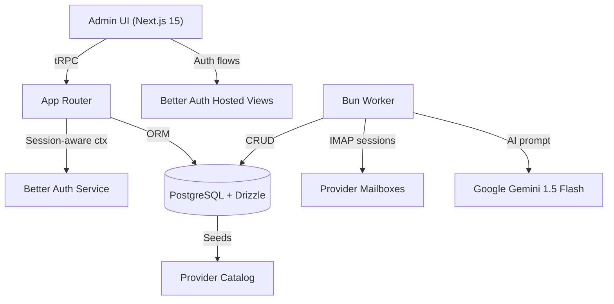

# CalendarSync Client Wiki

> Authoritative guide for client stakeholders operating the CalendarSync platform.

## Table of Contents

- [1. Executive Summary](#1-executive-summary)
- [2. Source Documents](#2-source-documents)
- [3. Solution Overview](#3-solution-overview)
- [4. Architecture](#4-architecture)
- [5. Functional Deep Dive](#5-functional-deep-dive)
  - [5.1 Provider Catalog & Connectivity](#51-provider-catalog--connectivity)
  - [5.2 Organization Operations](#52-organization-operations)
  - [5.3 User Administration](#53-user-administration)
  - [5.4 Flag Governance](#54-flag-governance)
  - [5.5 Event Ingestion Worker](#55-event-ingestion-worker)
- [6. Data Model Reference](#6-data-model-reference)
- [7. API Surface](#7-api-surface)
- [8. Environment & Deployment](#8-environment--deployment)
- [9. Operational Playbooks](#9-operational-playbooks)
- [10. Security & Compliance Notes](#10-security--compliance-notes)
- [11. Known Gaps & Future Work](#11-known-gaps--future-work)
- [12. Change History Summary](#12-change-history-summary)

## 1. Executive Summary

CalendarSync streamlines how organizations curate events from inbound email, approve them through an admin console, and publish verified entries to downstream calendars. The implemented codebase currently delivers:

- A Next.js 15 admin application secured by Better Auth for organization-aware access control.
- A provider catalog that stores IMAP/SMTP credentials, validates connectivity, and links providers to organizations.
- Administrative workflows for managing users, feature flags, and organization rosters.
- A Bun-powered worker that polls provider inboxes, extracts events with an AI-assisted parser, and persists normalized records in PostgreSQL.

## 2. Source Documents

| Document          | Status                                               | Notes                                                                              |
| ----------------- | ---------------------------------------------------- | ---------------------------------------------------------------------------------- |
| Statement of Work | Received (`docs/CalendarSync Statement of Work.pdf`) | Authoritative scope baseline for CalendarSync implementation and deliverables.     |
| Change Log        | Received (`docs/CalendarSync Change Log.pdf`)        | Tracks approved scope adjustments and release sign-offs for stakeholder alignment. |

## 3. Solution Overview

- **Audience**: Customer success managers, client administrators, and implementation partners who configure CalendarSync for each tenant.
- **Business Goals**: Centralize event intake from partner newsletters, reduce manual calendar updates, and enforce governance through configurable flags and provider-level controls.
- **Scope Highlights**:
  - Authentication, organization management, and auditing are handled by Better Auth and surfaced in the admin shell.
  - Providers encapsulate integration details for external mailboxes; only vetted providers with passing IMAP/SMTP tests can feed events.
  - Event extraction happens continuously via a worker so administrators see near-real-time updates without manual refreshes.

## 4. Architecture

**Runtime responsibilities**:

- The **admin UI** renders via the Next.js app router, reusing shared layout and breadcrumb components to deliver a consistent console.
- **tRPC procedures** enforce authentication and authorization server-side before touching the Drizzle ORM.
- The **worker** orchestrates per-provider IMAP sessions, coordinates concurrency, and persists deduplicated events.
- **PostgreSQL** stores both authentication artifacts (users, sessions, organizations) and application data (providers, flags, events).

## 5. Functional Deep Dive

### 5.1 Provider Catalog & Connectivity

- Provider definitions persist in the `provider` table with JSONB configuration for IMAP/SMTP credentials and runtime metadata.
- The admin catalog view lists providers, exposes IMAP/SMTP smoke tests, and supports create/edit/delete actions with optimistic UI feedback.
- Provider configuration is validated with rich Zod schemas before any mutation. Secrets are redacted when fetched for display to prevent leakage.
- Administrators can link provider catalogs to specific organizations, ensuring tenants only see approved ingest sources.
- Catalog endpoints stamp `lastTestedAt` timestamps, allowing operators to monitor integration health from the UI table.

### 5.2 Organization Operations

- The admin shell embeds Better Auth's `OrganizationSwitcher`, enabling multi-tenant switching without leaving the console.
- The Calendars page reuses Better Auth UI components to manage organizations, ensuring consistent onboarding/offboarding flows.
- Provider linking endpoints enforce that only organization admins can curate provider lists for their tenant, preserving data isolation.

### 5.3 User Administration

- The Users module offers faceted search (query term, roles, status, organization) with debounced filtering for large datasets.
- Inline actions allow banning/reactivating users; optimistic updates keep the grid responsive while server mutations complete.
- Role options and calendar pickers hydrate via dedicated tRPC queries so new roles/calendars automatically surface in filters.
- Pagination, sorting, and inline overflow indicators ("+N" calendars) are computed client-side for a richer admin experience.

### 5.4 Flag Governance

- Flags categorize events (e.g., marketing, compliance) using labeled slugs and priority levels enforced via database constraints.
- Admins can create, update, or delete flags through a modal form that auto-slugifies labels and validates priority bounds (1–5).
- Mutations optimistically refresh the listing and toast outcomes; conflict handling prevents duplicate slugs from entering the system.

### 5.5 Event Ingestion Worker

- On startup the worker loads active providers, constrains concurrency with a semaphore, and launches one IMAP session per provider up to the configured limit.
- Each session maintains a cursor in provider JSON config (`config.runtime.cursor`) to resume processing without re-ingesting historical mail.
- Incoming messages are parsed with `mailparser`; the payload is handed to an AI extraction helper (Gemini 1.5 Flash in production; a deterministic Faker stub is wired while `IS_DEV` remains `true`).
- Events are deduplicated by `(provider_id, external_id)` and enriched with metadata such as IMAP UID and mailbox, supporting traceability.
- Backoff logic introduces jittered exponential reconnects when IMAP sessions fail, preventing thundering-herd reconnect loops.

## 6. Data Model Reference

| Table                   | Purpose                    | Key Columns                                                | Notes                                                            |
| ----------------------- | -------------------------- | ---------------------------------------------------------- | ---------------------------------------------------------------- |
| `user`                  | Authenticated principals   | `role`, `banned`, `created_at`                             | Managed by Better Auth; `banned` users cannot sign in.           |
| `session`               | Active sessions            | `token`, `expires_at`, `user_id`                           | Stores impersonation metadata and active organization context.   |
| `organization`          | Tenant calendars           | `name`, `slug`                                             | Drives organization switching and provider linking.              |
| `member`                | User ↔ organization link  | `role`, `organization_id`, `user_id`                       | Roles determine admin privileges across org-scoped procedures.   |
| `provider`              | Integration definitions    | `category`, `status`, `config`, `last_tested_at`           | JSONB `config` stores IMAP/SMTP credentials plus runtime cursor. |
| `organization_provider` | Org/provider linkage       | `organization_id`, `provider_id`                           | Unique composite index prevents duplicates.                      |
| `flag`                  | Event classification       | `slug`, `priority`, `description`                          | Priority constrained to 1–5 via DB check.                        |
| `event`                 | Normalized calendar events | `provider_id`, `flag_id`, `start_at`, `end_at`, `metadata` | Enforces unique `(provider_id, external_id)` for dedupe.         |

## 7. API Surface

| Domain                                         | Procedure       | Description                                                   |
| ---------------------------------------------- | --------------- | ------------------------------------------------------------- |
| `healthCheck`                                  | `GET` (query)   | Returns "OK" for uptime monitoring.                           |
| `privateData`                                  | `GET` (auth)    | Echoes private session details for client-side guards.        |
| `providers.catalog.list`                       | Query           | Lists catalog entries with last-tested timestamps and status. |
| `providers.catalog.get`                        | Query           | Fetches a single provider with redacted secrets.              |
| `providers.catalog.upsert`                     | Mutation        | Creates or updates providers after Zod validation.            |
| `providers.catalog.delete`                     | Mutation        | Removes a provider by id.                                     |
| `providers.catalog.testImap` / `testSmtp`      | Mutation        | Runs live connectivity tests and stamps `lastTestedAt`.       |
| `providers.org.list`                           | Query           | Returns linked provider ids plus catalog summary for an org.  |
| `providers.org.link`                           | Mutation        | Reconciles provider assignments for an organization.          |
| `adminUsers.list`                              | Query           | Paginates users with filters and sorting.                     |
| `adminUsers.rolesOptions` / `calendarsOptions` | Query           | Supplies dropdown values for the UI.                          |
| `adminUsers.ban` / `reactivate`                | Mutation        | Toggles a user's banned status.                               |
| `adminFlags.*`                                 | Query/Mutations | CRUD over flag records with conflict detection.               |

## 8. Environment & Deployment

| Variable                          | Default  | Purpose                                                      |
| --------------------------------- | -------- | ------------------------------------------------------------ |
| `DATABASE_URL`                    | —        | PostgreSQL connection string shared by server and worker.    |
| `CORS_ORIGIN`                     | `""`     | Allowed origin for credentialed cross-site requests.         |
| `WORKER_MAX_CONCURRENT_PROVIDERS` | `5`      | Upper bound for simultaneous IMAP sessions.                  |
| `WORKER_POLL_INTERVAL_MS`         | `300000` | Minimum interval (ms) between passive mailbox scans.         |
| `WORKER_IDLE_KEEPALIVE_MS`        | `15000`  | IMAP idle heartbeat to avoid server disconnects.             |
| `WORKER_BACKOFF_MIN_MS`           | `1000`   | Starting delay for exponential backoff.                      |
| `WORKER_BACKOFF_MAX_MS`           | `60000`  | Maximum delay between reconnect attempts.                    |
| `WORKER_USE_FAKE_EXTRACTOR`       | `false`  | Enables the Faker-based email parser when AI credentials are unavailable. |
| `GOOGLE_GENERATIVE_AI_API_KEY`    | —        | Required by the AI SDK when enabling real Gemini extraction. |

**Deployment Notes**

- The Next.js server uses Bun scripts (`bun run --filter server …`) for database migrations and seeds; ensure seeds run post-migrate to provision baseline providers.
- Worker processes can be scaled horizontally; each instance coordinates its own cursor updates, so avoid overlapping credentials without clear partitioning.
- Middleware adds CORS headers globally, expecting frontend clients to originate from `CORS_ORIGIN`.

## 9. Operational Playbooks

| Task                       | Steps                                                                                                                                                            |
| -------------------------- | ---------------------------------------------------------------------------------------------------------------------------------------------------------------- |
| Bootstrap environment      | 1. `bun install` at repo root. 2. Configure `.env` with database, CORS origin, and AI key. 3. `bun db:push` (runs migrations + provider seeds).                  |
| Run admin console          | `bun dev` (root) or `bun run --filter server dev` to focus on Next.js app. Access via `http://localhost:3000` and use Better Auth hosted paths under `/auth/*`.  |
| Start worker ingestion     | From `apps/worker`, run `bun run start`. Provide environment variables identical to the server to share database access.                                         |
| Seed baseline providers    | `bun run --filter server db:seed` inserts Ethereal and Google provider templates for quick demos.                                                                |
| Test provider connectivity | In the admin UI, open **Providers → Edit**, update credentials, then click **Test IMAP/SMTP**; server mutations call live transports and update `lastTestedAt`.  |
| Ban or reinstate a user    | Navigate to **Admin → Users**, open row action menu, choose **Ban user** or **Reinstate user**; optimistic UI updates immediately while tRPC mutation completes. |

## 10. Security & Compliance Notes

- All privileged tRPC procedures wrap `protectedProcedure` and `adminProcedure`, ensuring server-side authorization even if the client is tampered with.
- Secrets stored in provider configs stay server-side; fetch procedures replace sensitive values with placeholder bullets before returning to the UI.
- Sessions set `SameSite=None; Secure; HttpOnly` cookies to support cross-origin hosted auth without sacrificing confidentiality.
- IMAP worker logs scrub secrets and mark message metadata only; rotate provider credentials regularly and monitor logs for repeated backoff cycles.

## 11. Known Gaps & Future Work

- The worker’s AI extraction defaults to Gemini but can fall back to the Faker-based stub (`extractEventFromEmailFake`) by setting `WORKER_USE_FAKE_EXTRACTOR=true` when the Gemini API key is unavailable.
- Provider UI lacks detail views for linked organizations or historical test results; consider extending schema to capture audit trails.
- Change-log alignment awaits the official PDF; until then, any signed-off scope changes must be tracked manually.
- Flag usage is defined but events currently insert with `flag_id = null`; extend ingestion or admin workflows to classify events post-ingest.

## 12. Change History Summary

Pending delivery of the authoritative Change Log PDF. Once provided, summarize approved scope adjustments, release dates, and responsible parties here to keep client stakeholders aligned with delivery cadence.
